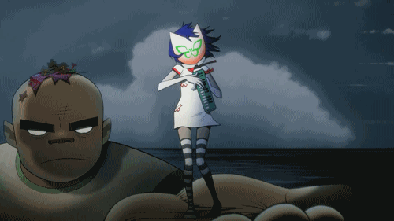

<!-- البانر الساكن -->

<!-- شريط التحميل المتحرك (بيعطي حركة للبانر) -->

---

## ✵ About Me

> *"Learning by building, improving through practice."*

- ✫ Artificial Intelligence Student @ **Al-Zaytoonah University of Jordan** — GPA **92.2/100**
- ✧ Passionate about **Machine Learning, Deep Learning, Computer Vision & NLP**
- ✪ Aspiring **Data Analyst** — Preprocessing, Analysis & Visualization
- ✤ Currently exploring: **YOLOv8 • MediaPipe • Deep Learning**

---

## 🔗 Connect With Me

  
  
  

---

## ♔ Tech Stack

### ♔ Programming Languages

  
  

### ♔ AI & Machine Learning

  

  
  
  
  
  

### ♔ Tools & Platforms

  
  
  

---

## ⇒ Featured Projects

<table align="center">
<tr>
<td>

**🚦 Traffic Sign Detection — YOLOv8**
Object detection system for recognizing traffic signs.
mAP@0.5: **92.8%** • Precision: **96.3%** • Recall: **94.1%**
`YOLOv8` `Python` `OpenCV`

</td>
<td>

**📝 Arabic Text Classification**
ML model classifying Arabic text into 5 categories using TF-IDF + Logistic Regression — **89% accuracy**
`Scikit-learn` `TF-IDF` `NLP`

</td>
</tr>
<tr>
<td>

**🤟 Sign Language Recognition**
Real-time gesture recognition via hand tracking with live Arabic translation
`MediaPipe` `OpenCV` `Machine Learning`

</td>
<td>

**🎨 ChromaSight-AI**
Color blindness detection & assistance using computer vision and image processing
`Python` `Computer Vision`

</td>
</tr>
</table>

---

## 🏅 Certifications & Achievements

- 🥇 **GPA 92.2/100** in Artificial Intelligence — Al-Zaytoonah University of Jordan
- 🏅 **AI Fundamentals** — IBM (2026)
- 🏅 **Introduction to AI & Generative AI** — Edraak (2026)
- 🔬 Exhibitor — Scientific Day AI Project Exhibition
- 📸 Media & Documentation Volunteer — Global Entrepreneurship Week 2025

---

## 📊 GitHub Stats

<!-- كرت الإحصائيات العامة (بنفس ألوان الثيم: خلفية غامقة، أزرق كهربائي، أحمر) -->

  
  
  <!-- كرت اللغات الأكثر استخداماً -->
  

<!-- كرت تفاصيل البروفايل الكامل (بعرض الشاشة) -->

  

<!-- الـ Streak (من خدمة demolab اللي كانت شغالة عندك) -->

  

---

## 🐍 Contribution Snake

<!-- لاحظي: هون بنستخدم نسخة Dark Mode للأفعى عشان تطلع على الخلفية الغامقة -->
<picture>
  <source media="(prefers-color-scheme: dark)" srcset="https://raw.githubusercontent.com/maram-elaian/maram-elaian/output/github-contribution-grid-snake-dark.svg">
  
</picture>

---

### ☕ "Learning by building, improving through practice."

