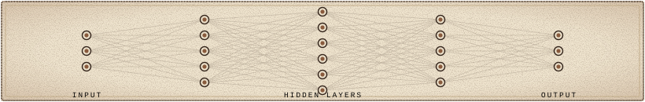
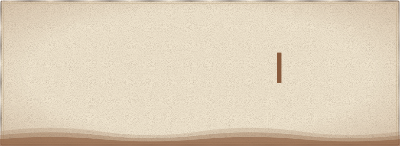
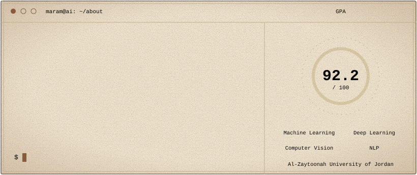
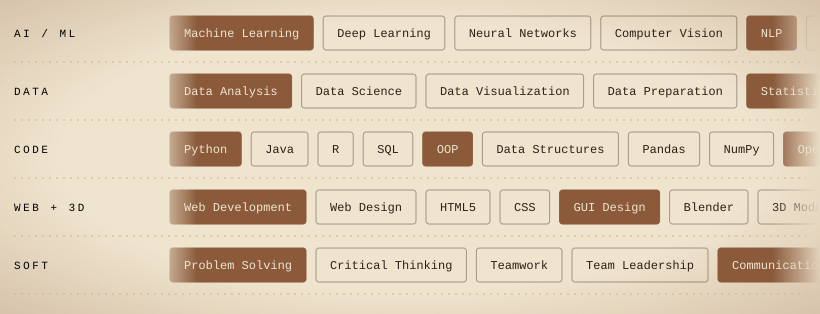
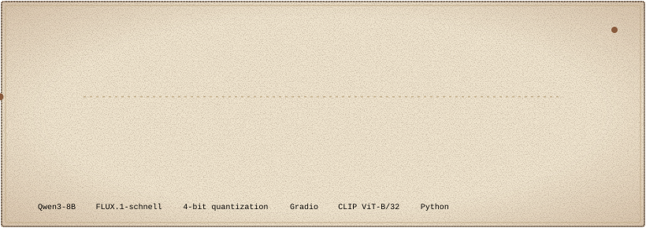
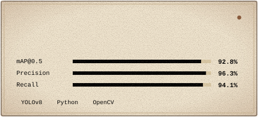
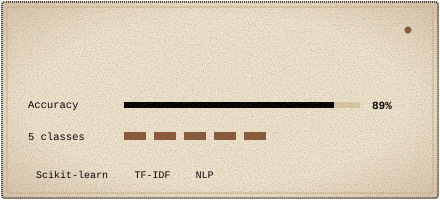
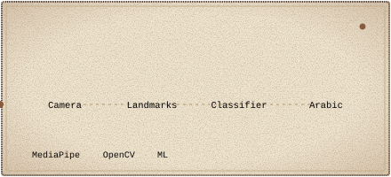
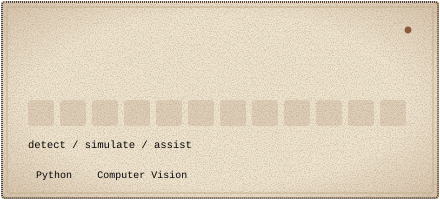

 

<a href="https://github.com/maram-elaian">
  <picture>
    <source media="(prefers-color-scheme: dark)" srcset="https://readme-typing-svg.demolab.com?font=Fira+Code&weight=500&size=22&duration=3000&pause=900&color=EFE4CE&center=true&vCenter=true&width=700&lines=Hi%2C+I'm+Maram+%F0%9F%91%8B;Building+models+that+see+and+read.;Turning+raw+data+into+insight.;Currently+exploring+YOLOv8+%E2%80%A2+MediaPipe+%E2%80%A2+Deep+Learning" />
    
  </picture>
</a>

 

 

## `> whoami`

 

## `> stack`

<picture>
  <source media="(prefers-color-scheme: dark)" srcset="https://cdn.simpleicons.org/python/EFE4CE" />
  
</picture>
&nbsp;
<picture>
  <source media="(prefers-color-scheme: dark)" srcset="https://skillicons.dev/icons?i=pytorch,tensorflow,opencv,matlab,java,r,html,css,js,git,github,vscode,linux&perline=13&theme=dark" />
  
</picture>

  

  

 

## `> projects`

  

<table>
<tr>
<td></td>
<td></td>
</tr>
<tr>
<td></td>
<td></td>
</tr>
</table>

 

## `> achievements`

 

## `> stats`

<picture>
  <source media="(prefers-color-scheme: dark)" srcset="https://github-readme-stats.vercel.app/api?username=maram-elaian&show_icons=true&hide_border=true&bg_color=2E1F16&title_color=EFE4CE&text_color=EFE4CE&icon_color=8A5A3B&rank_icon=github" />
  
</picture>

<picture>
  <source media="(prefers-color-scheme: dark)" srcset="https://github-readme-stats.vercel.app/api/top-langs/?username=maram-elaian&layout=compact&hide_border=true&bg_color=2E1F16&title_color=EFE4CE&text_color=EFE4CE" />
  
</picture>

 

<picture>
  <source media="(prefers-color-scheme: dark)" srcset="https://streak-stats.demolab.com?user=maram-elaian&hide_border=true&background=2E1F16&ring=8A5A3B&fire=8A5A3B&currStreakLabel=EFE4CE&sideLabels=EFE4CE&currStreakNum=EFE4CE&sideNums=EFE4CE&dates=8A5A3B" />
  
</picture>

 

<picture>
  <source media="(prefers-color-scheme: dark)" srcset="https://raw.githubusercontent.com/maram-elaian/maram-elaian/output/github-contribution-grid-snake-dark.svg" />
  
</picture>

